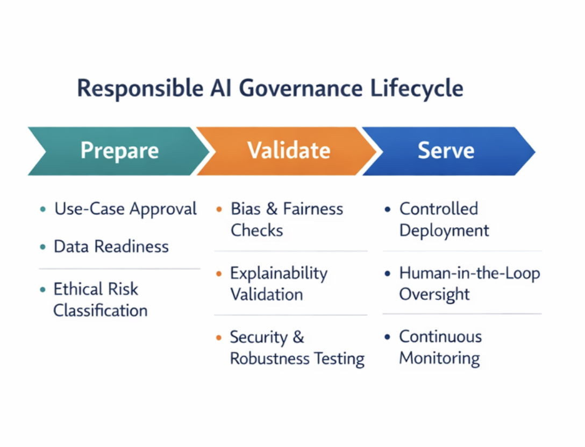
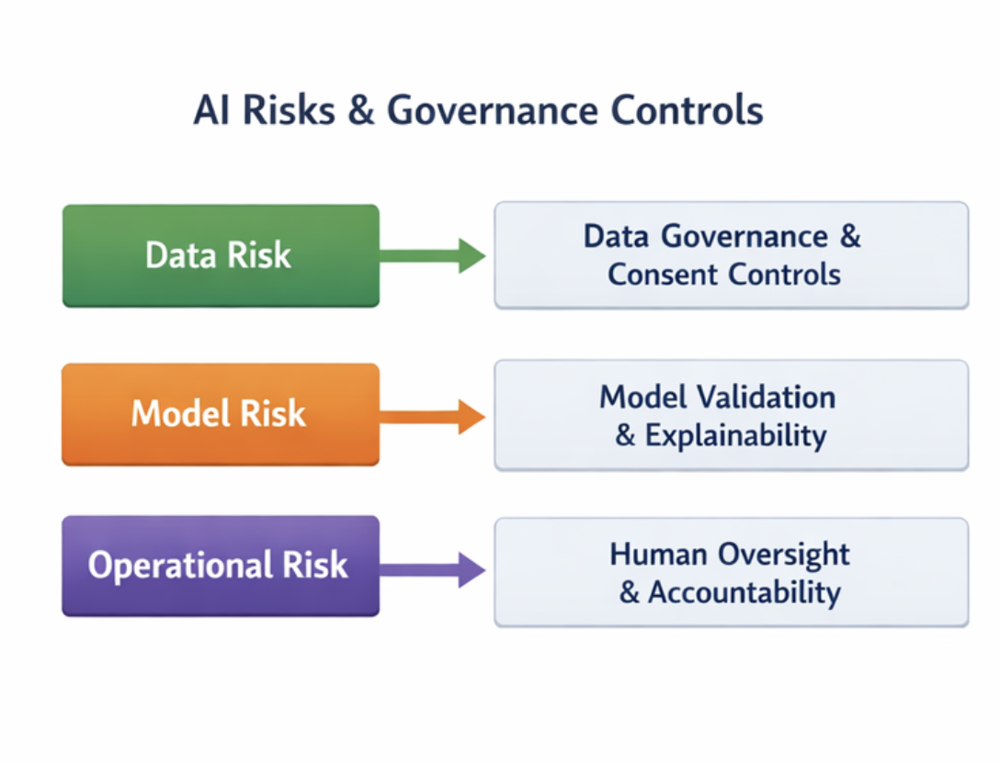

# Responsible AI Governance for Enterprise Systems

## Overview
This repository presents a practical, enterprise-oriented approach to **Responsible AI governance**, focusing on how ethical principles are operationalized across the AI lifecycle. The work bridges AI ethics, risk management, and delivery governance to support real-world AI and Generative AI deployments.

This project was developed as part of the **MS in Applied AI** program at the **University of San Diego**, with a strong emphasis on translating ethical theory into enterprise operating models.

## Problem Statement
As organizations scale AI and Generative AI systems, ethical risk increasingly arises not from algorithms alone, but from:
- Data misuse and bias
- Lack of governance and accountability
- Opaque decision-making systems
- Absence of human oversight in automated workflows

This repository addresses how Responsible AI can be embedded into **enterprise delivery**, rather than treated as an afterthought or policy-only concern.

## Key Contributions
- A practical **Responsible AI governance lifecycle** aligned to enterprise delivery models
- A structured **AI risk taxonomy** spanning data, model, and operational risks
- Governance controls and guardrails for production AI systems
- An enterprise-style case study applying Responsible AI principles to a real AI use case

## Responsible AI Governance Lifecycle
The proposed lifecycle follows a **Prepare – Validate – Serve** model:

- **Prepare**: Use-case approval, data readiness, ethical risk classification
- **Validate**: Bias testing, explainability, robustness and security checks
- **Serve**: Controlled deployment, monitoring, and human-in-the-loop oversight

This lifecycle ensures Responsible AI is integrated into delivery workflows, not bolted on after deployment.

## Responsible AI Governance Lifecycle

## AI Risk and Governance Controls

## Case Study
The included case study demonstrates how Responsible AI principles can be applied to an enterprise AI system, covering:
- Ethical risk identification
- Control mapping
- Governance checkpoints
- Ongoing monitoring and accountability

No proprietary systems, data, or client-specific implementations are referenced.

## Personal Reflection: Responsible AI & Ethics

## Intended Audience
- AI and Data Leaders
- Enterprise Architects
- AI Governance and Risk Teams
- Practitioners building production AI systems

## Disclaimer
This repository is based on academic work and does not disclose any confidential, proprietary, or client-specific information.
